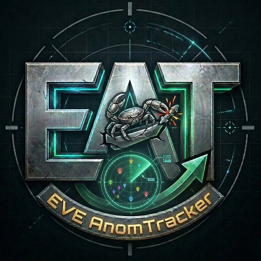

# EVE AnomTracker

A premium, lightweight desktop overlay for EVE Online players to track combat anomaly outcomes with precision and style.

## 🚀 Key Features

### ⚔️ Combat Tracking
- **One-Click Logging**: Quickly record anomaly completions with a streamlined interface.
- **Detailed Outcomes**: Track DED Escalations, Faction Spawns, Capital Spawns, and more with specialized toggles.
- **Location Intelligence**: Automatically associates logs with systems and regions.
- **Custom Site Support**: Configure your own list of anomalies to track.

### 📊 Advanced Statistics
- **Live Success Rates**: Real-time calculation of escalation and spawn percentages.
- **Outcome Breakdown**: Visual tally of specific encounter types (DED, Titan spawns, etc.).
- **Activity Heartbeat**: A 30-day vertical bar chart showing your "combat heartbeat," filterable by specific site types to analyze drop rates.
- **Date Filtering**: analyze your performance by day, week, month, or custom ranges.

### 🖥️ Overlay Experience
- **Always-on-Top Mode**: Keep your tracker visible while flying in space.
- **Adjustable Opacity**: Blend the tracker into your EVE UI for a seamless look.
- **Dynamic Orientation**: Switch between **Portrait** (compact) and **Landscape** (expanded) layouts.
- **Global Scaling**: Resize the entire UI to fit your monitor resolution.
- **Cinematic Feel**: Integrated loading sequence and cybernetic audio feedback for actions.

### 💾 Data & Security
- **Local First**: All data is stored in a private SQLite database on your machine.
- **Auto-Backup**: Configurable automated backups to ensure your history is never lost.
- **Portable**: Run the standalone `.exe` from anywhere; logs and settings are kept in the same folder under `/data`.

## ⚙️ Settings Guide

Detailed Explanations of Application Settings

### 1. Window Controls
*   **Orientation**: Toggles between a vertical (Portrait) or horizontal (Landscape) layout. Both modes are designed to be placed at the side or on top of your EVE windows, depending on what best fits your specific UI layout.
*   **Always on Top**: Ensures the tracker remains visible even when the EVE Online client is the active window.
*   **Combat Log Scale & Opacity**: Provides granular control over the size and transparency of the UI. This allows you to "ghost" the app over unused space within your game window without blocking critical information.
*   **Enable UI Sounds**: Toggles audio feedback for site logging and special outcome triggers.

### 2. Preferred Systems (Location Tracking)
*   **Search/Manage**: An optional feature for users who wish to track the specific locations where their anomalies are being completed.
*   **Preferred List**: Search the EVE database to add your home systems to a quick-select list. This filters the main logging dropdown so you only see the systems relevant to your current session.

### 3. Custom Site List
*   **Comma-Separated List**: Define the specific anomaly types you are farming (e.g., Haven, Sanctum, Forsaken Hub). This list populates the "Site Type" selection on the main logging screen.

### 4. Data Backup
*   **Auto-Backup Frequency**: Set how often the app automatically archives your data (Daily, Weekly, Monthly).
*   **Backup Destination**: The local directory where backups are stored. Ideally, this should be a folder synced with OneDrive or Google Drive for cloud redundancy.
*   **Backup Data Now**: A manual trigger that immediately zips your `anomtracker.db` and `settings.json` and moves them to your backup destination.

## 🛠️ How to Use (Portable)

AnomTracker can be run as a standalone application without installation:

1. Download the standalone `.exe` file from the [Releases](../../releases) page.
2. Move the `.exe` to any folder on your computer.
3. Double-click to run!

**Data Storage:** Your history and settings are stored in the `/data` folder located in the same directory as the application. This ensures your data travels with the app if you move or update it.

---

*Fly safe, Capsuleer. o7*
